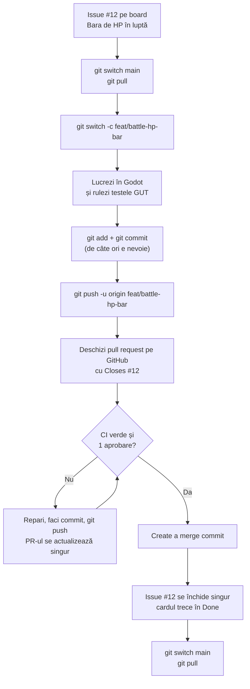

# 0. Introducere: de ce Git și ce e GitHub

> Timp de citit: 15 minute. La final știi de ce lucrăm așa și cum arată o zi normală în echipă.

## De ce avem nevoie de Git

Suntem 4 oameni care lucrează la același joc, în același timp, pe calculatoare diferite.
Fără un sistem comun ar arăta așa: arhive pe WhatsApp, `joc_final_v3_bun.zip`, cineva suprascrie munca altcuiva și nimeni nu mai știe care e varianta corectă.

Git rezolvă exact problema asta:

| Problema | Ce face Git |
|---|---|
| „Cine a schimbat asta și de ce?” | Fiecare schimbare e un **commit** cu autor, dată și mesaj. |
| „Am stricat ceva, vreau varianta de ieri.” | Poți reveni la orice commit vechi. |
| „Lucrăm amândoi în același timp.” | Fiecare lucrează pe **branch-ul** lui, apoi le unim. |
| „Vreau să văd codul tău înainte să intre în joc.” | **Pull request** cu review. |
| „Profesorul întreabă cine ce a făcut.” | Istoricul arată commit-urile fiecăruia, cu nume. |

Ultimul rând contează direct pentru notă. Profesorul se uită la cine a contribuit și ne pune întrebări despre propriul cod. Commit-urile tale, făcute cu contul tău, sunt dovada muncii tale.

## Git și GitHub nu sunt același lucru

| | Git | GitHub |
|---|---|---|
| Ce este | Un program pe calculatorul tău | Un site (github.com) |
| Ce face | Ține istoricul fișierelor, local | Ține o copie a repo-ului online și adaugă unelte de echipă |
| Merge fără internet? | Da | Nu |
| Ce folosim din el | commit, branch, merge, push, pull | Pull requests, review, Issues, Projects (board), Actions (CI), Pages (jocul online) |

Pe scurt: **Git** e unealta, **GitHub** e locul unde ne întâlnim.

## Regulile echipei într-un singur ecran

Le vei vedea explicate pe larg în capitolele următoare. Aici e doar lista:

1. **Nimeni nu lucrează direct pe `main`.** `main` e protejat: intră doar prin pull request.
2. **Un branch pentru fiecare sarcină**, cu nume de forma `feat|fix|test|docs/<zonă>-<subiect>`, de exemplu `feat/battle-hp-bar`.
3. **Mesaje de commit în stil Conventional Commits**, în engleză: `feat(battle): show player HP bar`.
4. **Fiecare PR are**: `Closes #N`, 2 rânduri „De ce”, pașii „Cum testezi” și o captură de ecran (pentru logică fără ecran, rezultatul testelor GUT).
5. **1 aprobare** de la cineva care a rulat codul, plus **CI verde**. Apoi merge commit (nu squash).
6. **Commit-uri cu adresa ta noreply de la GitHub**, ca să conteze în statistici fără să-ți arăți e-mailul.
7. **Nu faci merge de mână la fișiere `.tscn`.** Păstrezi o parte și refaci schimbarea în editor.
8. **Un proprietar pentru fiecare scenă** (fișierul `.github/CODEOWNERS`).
9. **`project.godot` se schimbă doar în PR-uri mici, dedicate.**
10. **Fără build-uri, log-uri sau date de la testeri în repo.**

## Cum arată o zi de lucru

Să zicem că Ioana are de făcut bara de HP din luptă (issue #12 pe board).

În cuvinte:

1. Iei un issue de pe board și îl muți în „In progress”.
2. Îți aduci `main` la zi și faci un branch nou din el.
3. Lucrezi și faci commit-uri mici, des.
4. Trimiți branch-ul pe GitHub (push) și deschizi un pull request.
5. GitHub Actions rulează automat verificările (CI). Un coleg rulează codul tău și îl aprobă sau cere schimbări.
6. Când e verde și aprobat, apeși merge. Issue-ul se închide singur.
7. Îți aduci din nou `main` la zi și iei următorul issue.

## Ritmul săptămânii

| Când | Ce se întâmplă |
|---|---|
| **Luni, la laborator** | 15 min demo pe telefon, 10 min retro, 20 min planificare pe board, apoi lucru în perechi. |
| **Marți până sâmbătă** | Lucrezi pe issue-urile tale. Deschizi PR-uri. Faci review la PR-urile colegilor. |
| **Joi** | Check-in de 3 rânduri: gata / urmează / blocat. |
| **Duminică, 22:00** | PR-urile săptămânii sunt îmbinate în `main`. Ce nu e gata trece la săptămâna următoare. |
| **Săptămânal** | David ține 1 oră de întrebări despre Godot. |

Sfat: deschide PR-ul cel târziu sâmbătă, ca să aibă colegul timp să-l ruleze și să-l aprobe până duminică seara.

## Cum citești ghidul

- Capitolele 0-3 și exercițiul 1 din capitolul 10 sunt **obligatorii înainte de laboratorul din 12 octombrie**.
- Capitolele 4-8 le citești în prima săptămână de lucru real.
- Capitolul 9 e pentru momentele în care ceva nu merge. Ține-l la îndemână.
- Capitolul 10 are exercițiile pe care le facem împreună.
- [Fișa de comenzi](fisa-de-comenzi.md) e o pagină de ținut deschisă lângă terminal.

Toate comenzile din ghid se scriu în terminal: **Terminal** pe macOS și Linux, **Git Bash** sau **PowerShell** pe Windows. Comanda se scrie fără semnul `$` și fără comentariile de după `#`.

---

Următorul: [1. Instalare și configurare](01-instalare.md)
