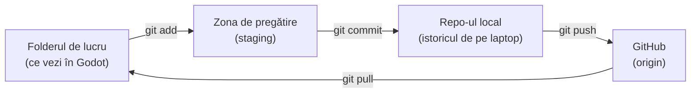
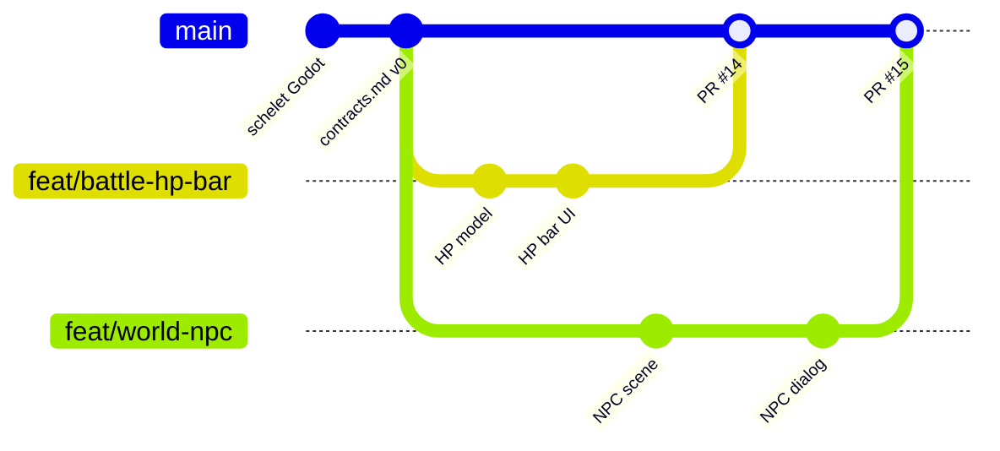

# 2. Conceptele de bază

> Timp: 20 minute. Fără comenzi de rulat. La final înțelegi cuvintele pe care le auzi la fiecare laborator.

## 2.1 Cuvintele, pe scurt

| Termen | Ce înseamnă | Comparație |
|---|---|---|
| **Repository (repo)** | Folderul proiectului plus tot istoricul lui. | Un dosar cu toate versiunile, nu doar ultima. |
| **Commit** | O „fotografie” a fișierelor alese, cu autor, dată și mesaj. | O salvare cu nume în joc. |
| **Branch** (ramură) | O linie de lucru separată. Pornește dintr-un commit și merge mai departe independent. | O copie a salvării pe care experimentezi fără s-o strici pe cea bună. |
| **`main`** | Branch-ul principal. Mereu funcționează. Din el facem build-ul jocului. | Salvarea „oficială”. |
| **Remote** (`origin`) | Copia repo-ului de pe GitHub. `origin` e numele ei implicit. | Serverul unde stă salvarea comună. |
| **Clone** | Prima descărcare a repo-ului pe calculatorul tău, cu tot istoricul. | Instalezi jocul. |
| **Pull** | Aduci pe calculatorul tău commit-urile noi de pe GitHub. | Descarci actualizarea. |
| **Push** | Trimiți pe GitHub commit-urile tale noi. | Urci salvarea ta pe server. |
| **Pull request (PR)** | O cerere: „vreau să unesc branch-ul meu în `main`”. Are discuție, review și verificări. | Predai tema și profesorul o corectează înainte s-o pună în catalog. |
| **Review** | Un coleg citește și rulează schimbările din PR, comentează și aprobă sau cere schimbări. La noi e opțional. | Corectura. |
| **Merge** | Unirea a două branch-uri. La noi: PR-ul cu CI verde intră în `main` printr-un *merge commit*. | Lipești capitolul tău în cartea comună. |
| **Conflict** | Doi oameni au schimbat aceleași rânduri. Git nu știe ce să păstreze și te întreabă. | Doi editori au corectat aceeași frază diferit. |
| **CI** | Verificări automate (GitHub Actions) care rulează la fiecare PR. | Un coleg robot care rulează testele în locul tău. |

## 2.2 Unde stau fișierele tale

Pe calculatorul tău, Git are trei „locuri”, iar GitHub e al patrulea. Comenzile mută schimbările dintr-un loc în altul:

- **Folderul de lucru**: fișierele normale pe care le editezi.
- **Staging**: lista de schimbări pe care le pui în următorul commit. Îți permite să alegi: „vreau în commit doar scriptul ăsta, nu și scena pe care Godot a modificat-o singur”.
- **Repo-ul local**: commit-urile tale. Sunt salvate, dar **doar la tine**. Dacă ți se strică laptopul, le pierzi.
- **GitHub**: după `git push`, colegii le pot vedea.

Regula de aur: **un commit care nu e pe GitHub nu există pentru echipă.** Fă push cel puțin o dată pe zi în care lucrezi.

## 2.3 Branch-uri și merge, desenat

Fiecare cerc e un commit. Prima linie, cea de sus, e `main`. Fiecare coleg pornește din `main`, lucrează pe branch-ul lui și revine prin PR:

Ce vezi în desen:

1. Ioana și David au pornit amândoi din același `main`.
2. Au lucrat în paralel, fără să se încurce.
3. PR-ul Ioanei (#14) a intrat primul. Apoi PR-ul lui David (#15).
4. Cercurile de pe `main` marcate „PR #14” și „PR #15” sunt **merge commit-urile**. Ele leagă branch-urile de `main`, iar commit-urile fiecăruia rămân în istoric cu numele autorului.

## 2.4 De ce merge commit și nu squash

GitHub poate uni un PR în trei feluri. Noi folosim doar **Create a merge commit**:

| Metodă | Ce se întâmplă | La noi |
|---|---|---|
| **Create a merge commit** | Toate commit-urile tale intră în `main`, plus un commit de unire. | Da, singura activată |
| Squash and merge | Toate commit-urile PR-ului devin unul singur. | Dezactivat |
| Rebase and merge | Commit-urile sunt copiate pe vârful lui `main`, fără commit de unire. | Dezactivat |

Motivul: vrem un istoric detaliat, în care se vede pas cu pas ce a făcut fiecare. Graficul **Insights → Contributors** numără commit-urile de pe `main` (fără commit-urile de unire), deci fiecare commit mic al tău contează.

## 2.5 Ce e `HEAD`

`HEAD` înseamnă „unde ești acum”: de obicei vârful branch-ului pe care lucrezi. Îl vei vedea în mesaje ca `HEAD -> feat/battle-hp-bar` sau în conflicte, ca `<<<<<<< HEAD` (partea ta).

## 2.6 Verifică-te

Răspunde în gând. Răspunsul e în paranteză:

1. Ai făcut commit, dar nu push. Vede Mariana schimbarea ta? (Nu.)
2. Ce comandă aduce pe laptopul tău ce au urcat colegii? (`git pull`.)
3. De ce nu lucrăm direct pe `main`? (Pentru că `main` trebuie să funcționeze mereu și orice schimbare trece prin review și CI.)
4. Ce leagă un PR de un issue? (`Closes #N` în descrierea PR-ului.)

---

Înapoi: [1. Instalare](01-instalare.md) · Următorul: [3. Primul flux complet](03-primul-flux.md)
