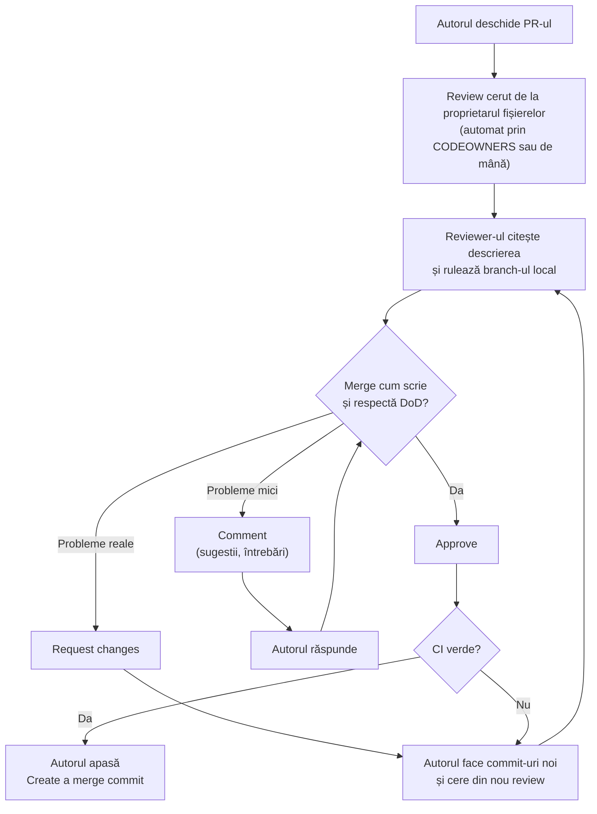

# 4. Review: cum citești și aprobi codul unui coleg

> Timp: 20 minute de citit. Un review normal durează 15-30 de minute.

## 4.1 De ce facem review

- **Găsim greșeli înainte să ajungă în `main`.** `main` trebuie să meargă mereu, pentru că din el facem build-ul de pe telefon.
- **Toți înțelegem tot jocul.** La prezentarea finală profesorul poate întreba pe oricine despre orice.
- **Regula din Definition of Done**: fiecare PR are **1 aprobare de la cineva care a rulat codul**. Doar citit nu ajunge.

Kevin face multe review-uri, dar **nu scrie și nu repară codul colegilor**. Dacă ceva trebuie schimbat, scrie comentariul, iar autorul face schimbarea. La fel faci și tu.

## 4.2 Drumul unui PR



## 4.3 Pasul 1: citește descrierea

Înainte de cod, citește în PR:

- **Issue-ul legat** (`Closes #N`). Deschide-l. Ce trebuia să facă?
- **De ce**. Are sens soluția?
- **Cum testezi**. Ăștia sunt pașii pe care îi vei urma.
- **Captura**. Arată ce zice descrierea?

Dacă lipsește ceva din astea, primul tău comentariu e: „Te rog completează partea Cum testezi.” Nu continui fără ea.

## 4.4 Pasul 2: uită-te la diferențe

Tab-ul **Files changed**: verde = rând adăugat, roșu = rând șters.

Uită-te întâi la **lista de fișiere**. Semnale de alarmă:

| Vezi în listă | Problema |
|---|---|
| `.godot/...` | Cache-ul Godot. Nu are ce căuta în repo. |
| `addons/gut/...` | GUT se instalează cu scriptul, nu se comite. |
| `build/`, `*.zip`, `*.pck`, `*.wasm` | Build-uri. Nu intră în repo. |
| O scenă `.tscn` din zona altcuiva, cu schimbări mici pe care autorul nu le pomenește | Probabil Godot a resalvat-o singur. Cere s-o scoată din PR. |
| `project.godot` într-un PR mare | `project.godot` se schimbă doar în PR-uri mici, dedicate. |
| Fișiere cu date de la testeri, log-uri | Nu intră niciodată în repo. |

## 4.5 Pasul 3: rulează branch-ul la tine

Întâi asigură-te că nu ai schimbări nesalvate pe branch-ul tău (`git status` trebuie să fie curat; dacă nu, fă commit sau vezi `git stash` în capitolul 9).

```bash
git fetch
git switch feat/battle-hp-bar
```

`git switch` vede că branch-ul există pe GitHub și îți face automat o copie locală care îl urmărește. Dacă ai mai rulat branch-ul ăsta altă dată, ai deja o copie locală veche: după `git switch` rulezi și `git pull`, ca să ai ultimele commit-uri.

Variantă cu GitHub CLI, după numărul PR-ului:

```bash
gh pr checkout 14
```

Apoi:

1. Dacă nu ai rulat niciodată scriptul GUT în clona ta: `bash tools/install_gut.sh` (Windows, în PowerShell: `powershell -ExecutionPolicy Bypass -File tools/install_gut.ps1`).
2. Deschide proiectul în Godot 4.7.2. Urmează exact pașii din **Cum testezi**.
3. Rulează testele GUT (panoul GUT din editor → **Run All**).
4. Dacă PR-ul atinge `data/`: `python3 tools/validate_data.py`.

Când termini, curăță ce a schimbat Godot cât ai testat și întoarce-te pe `main` (sau direct pe branch-ul tău, cu numele lui):

```bash
git restore .
git switch main
```

`git restore .` șterge doar schimbările **nesalvate în commit** de pe branch-ul colegului. Commit-urile lui sunt în siguranță pe GitHub. **Nu face niciodată commit sau push pe branch-ul altcuiva**, decât dacă ți-o cere explicit.

Dacă după `git restore .` comanda `git status` încă arată fișiere noi (**Untracked files**) de tipul `*.uid` sau `*.import`, înseamnă că autorul a uitat să le comită. Asta e un comentariu „Obligatoriu” în review. Le ștergi la tine: întâi `git clean -n` (doar arată ce s-ar șterge). Dacă în listă sunt doar fișierele colegului, rulezi `git clean -f`. Dacă apare și un fișier nou de-al tău, nu rula `git clean -f`: ștergi de mână doar fișierele colegului.

## 4.6 Pasul 4: scrie comentarii

În **Files changed**:

1. Treci cu mouse-ul peste un rând. Apare un **+** albastru. Apasă-l. (Pentru mai multe rânduri: dai click pe numărul primului rând, tragi până la ultimul, apoi apeși **+** pe ultimul.)
2. Scrii comentariul.
3. Apeși **Start a review** (nu „Add single comment”). Așa toate comentariile pleacă împreună, la final, și autorul primește o singură notificare.

### Sugestii pe care autorul le poate accepta cu un clic

În căsuța de comentariu apasă iconița **Add a suggestion** (sau scrie de mână). Apare un bloc în care rescrii rândul:

````markdown
```suggestion
var max_hp: int = 100
```
````

Autorul apasă **Commit suggestion** și schimbarea intră în PR ca un commit nou, făcut pe GitHub. Apoi, la el pe calculator, rulează `git pull --no-edit` pe branch-ul lui, altfel următorul `git push` e refuzat (capitolul 9, cazul 5).

### Cum scrii un comentariu bun

Începe cu un cuvânt care arată cât de important e:

| Prefix | Înseamnă | Exemplu |
|---|---|---|
| **Obligatoriu:** | Trebuie reparat înainte de merge. | „Obligatoriu: textul «Atacă» e scris direct în cod. Folosește `tr("BATTLE_ATTACK")`.” |
| **Sugestie:** | Ar fi mai bine, dar decide autorul. | „Sugestie: numele `x` ar fi mai clar ca `damage`.” |
| **Întrebare:** | Vrei să înțelegi. | „Întrebare: de ce verifici HP-ul în `_process()` și nu când vine semnalul?” |
| **Bravo:** | Ceva făcut bine. Scrie și asta. | „Bravo: testul pentru HP la zero e exact ce trebuia.” |

Reguli:

- Comentezi **codul**, nu omul. „Funcția asta e lungă”, nu „Ai scris prost”.
- Fii **concret**: rândul, problema, ce propui.
- Cel puțin o **întrebare „de ce”** la fiecare PR. Autorul trebuie să-și poată explica fiecare rând (o cere DoD și o cere profesorul la final).

## 4.7 Pasul 5: trimite review-ul

Sus în dreapta, în **Files changed**, apeși **Review changes** (în interfața nouă se numește **Submit review**). Alegi:

| Opțiune | Când |
|---|---|
| **Comment** | Ai doar sugestii sau întrebări. Nu blochezi și nu aprobi. |
| **Approve** | Ai rulat codul, merge, respectă DoD. Poate avea și sugestii mici. |
| **Request changes** | Există cel puțin un „Obligatoriu”. PR-ul nu se poate uni până nu aprobi după reparație. |

Scrii un rezumat de 1-2 rânduri („Rulat pe desktop, merge. Doar cele 2 comentarii obligatorii.”) și apeși **Submit review**.

## 4.8 Ce verifici: lista de review

Pornește de la **Definition of Done** (versiunea oficială e în [`docs/DEFINITION_OF_DONE.md`](../DEFINITION_OF_DONE.md)):

- [ ] **Issue legat**: descrierea are `Closes #N`.
- [ ] **Rulat de tine**: ai urmat pașii din „Cum testezi” și merge.
- [ ] **Teste GUT** pentru logică (calcule, reguli, date). UI-ul pur poate să nu aibă.
- [ ] **Fără erori în build-ul web** (desktop + 1 telefon), dacă schimbarea se vede sau se aude: autorul confirmă în PR, cu captură.
- [ ] **Fără text UI scris direct în cod**: tot textul vizibil vine din chei `MENU_`, `BATTLE_`, `WORLD_`, `UI_` din `i18n/ui.csv` (`tr("...")`) sau din câmpurile `{ro, en}` din `data/`.
- [ ] **Asset-urile noi sunt trecute în `CREDITS.md`**.
- [ ] **Commit-urile apar cu username-ul autorului** (adresa noreply), iar fișierele `.uid` noi sunt în PR.
- [ ] **Autorul explică fiecare rând**: ai pus o întrebare „de ce” și răspunsul te-a convins.

Apoi, câteva lucruri specifice proiectului:

- [ ] **Godot 4, nu Godot 3.** Semne de cod vechi: `KinematicBody2D`, `yield`, `TileMap` (la noi: `TileMapLayer`), `onready var` fără `@`, `export var` fără `@`.
- [ ] **GDScript tipizat**: `var hp: int = 100`, `func take_damage(amount: int) -> void:`.
- [ ] **Nume clare**, funcții scurte, comentarii în engleză doar unde codul nu se explică singur.
- [ ] **Fără `print()` uitate**, fără cod comentat, fără fișiere în plus.
- [ ] **Schimbă doar fișierele autorului**, sau proprietarul lor a aprobat.
- [ ] **Contractele** din `docs/contracts.md` sunt respectate: aceleași nume de funcții, semnale și chei.
- [ ] **Fișiere în folderul corect** (fiecare zonă are proprietarul ei) și **nume `snake_case`**.
- [ ] **Nimic din lista de alarmă** de la 4.4.
- [ ] **CI verde.**

Schimbările în contracte după înghețare cer **2 aprobări**, dintre care una de la cealaltă parte a contractului.

## 4.9 Când ești autorul

- Răspunzi la **fiecare** comentariu: fie repari („Reparat în abc1234”), fie explici de ce rămâne așa.
- Repari cu **commit-uri noi** pe același branch și `git push`. Nu rescrie istoria (fără `--force`).
- După reparații apeși **Resolve conversation** la fiecare comentariu rezolvat și **Re-request review** (săgețile rotunde de lângă numele reviewer-ului).
- Nu lua comentariile personal. Un review cu multe comentarii înseamnă că cineva s-a uitat serios la munca ta.

## 4.10 Ritm

- Răspunde la o cerere de review în **24 de ore** (maximum 48), chiar și doar cu „mă uit diseară”.
- Demo-ul de luni folosește doar ce e îmbinat până **duminică la 22:00**. Un review întârziat blochează un coleg.

---

Înapoi: [3. Primul flux](03-primul-flux.md) · Următorul: [5. Sincronizare și conflicte](05-sincronizare-si-conflicte.md)
