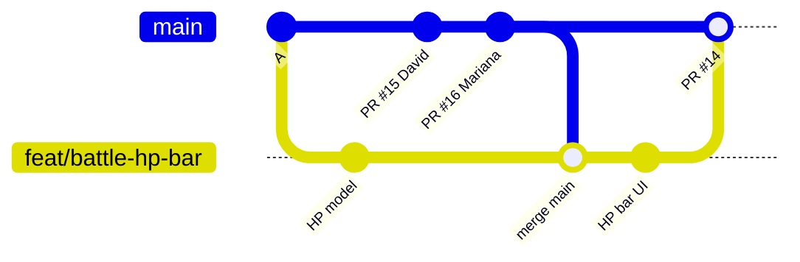

# 5. Sincronizare și conflicte

> Timp: 30 minute. Capitolul cel mai important după fluxul de bază. Exercițiul 2 din capitolul 10 îl pune în practică.

## 5.1 De ce trebuie să te sincronizezi

În timp ce tu lucrezi pe branch-ul tău, colegii îmbină PR-uri în `main`. Branch-ul tău rămâne în urmă. Cu cât rămâne mai mult, cu atât e mai mare șansa de conflict și cu atât e mai greu de rezolvat.

Soluția: **aduci `main` în branch-ul tău des**, măcar o dată pe zi în care lucrezi și mai ales înainte să ceri review.

## 5.2 Rutina de început de zi

Întâi salvezi în commit ce ai lucrat (sau pui deoparte cu `git stash`, vezi capitolul 9). Apoi:

```bash
git switch main
git pull
git switch feat/battle-hp-bar
git merge main --no-edit
git push
```

Ce face fiecare rând:

| Comandă | Efect |
|---|---|
| `git switch main` | Te muți pe `main`. |
| `git pull` | Aduci de pe GitHub tot ce s-a îmbinat. |
| `git switch feat/battle-hp-bar` | Te întorci pe branch-ul tău. |
| `git merge main --no-edit` | Aduci noutățile din `main` în branch-ul tău. `--no-edit` păstrează mesajul automat „Merge branch 'main' into ...”, fără să deschidă editorul. |
| `git push` | Urci branch-ul actualizat. PR-ul se actualizează și CI rulează din nou. |

Varianta din [CONTRIBUTING.md](../../CONTRIBUTING.md) face același lucru fără să treci prin `main`:

```bash
git fetch origin
git merge origin/main --no-edit
```

**Atenție la Godot.** Înainte de `git switch` sau `git merge`, salvează tot în Godot (sau, mai sigur, închide-l). Dacă după aceea Godot arată fereastra **Files have been modified outside Godot**, apeși **Reload from disk**. Nu apăsa **Ignore external changes**: Godot ar salva peste fișiere versiunea veche din editor și ai pierde ce a adus merge-ul.

Desenat:



Commit-ul „merge main” aduce în branch-ul Ioanei munca lui David și a Marianei. Ioana testează totul împreună înainte de PR.

**Variantă din browser**: dacă pe pagina PR-ului apare butonul **Update branch** (apare doar când nu sunt conflicte), el face același merge pe GitHub. Apeși chiar **Update branch**, nu **Update with rebase** din săgeata de lângă el. Apoi, local, pe branch-ul tău rulezi `git pull --no-edit`, ca să ai și la tine commit-ul nou.

### De ce merge și nu rebase

Probabil vei citi pe internet despre `git rebase`. La noi **nu îl folosim**: rescrie istoria, cere `git push --force` și poate șterge munca unui coleg. `git merge` e mai lung în istoric, dar e sigur. Regula echipei e merge.

## 5.3 Ce e un conflict

Git unește singur schimbările din locuri diferite ale unui fișier. Conflictul apare doar când **ambele părți au schimbat aceleași rânduri** (sau rânduri lipite unul de altul). Atunci Git se oprește și te întreabă ce să păstreze.

Un conflict **nu e o eroare** și nu ai stricat nimic. E o întrebare.

## 5.4 Conflict într-un fișier text, pas cu pas

**Situația**: Ioana lucrează pe branch-ul `feat/battle-attack-menu` și adaugă cheia `BATTLE_ATTACK` la finalul fișierului de traduceri `i18n/ui.csv`. Între timp, PR-ul lui David a adăugat cheia `WORLD_TALK` exact în același loc și a intrat în `main`.

### 1. Faci merge și apare conflictul

```bash
git merge main --no-edit
```

```text
Auto-merging i18n/ui.csv
CONFLICT (content): Merge conflict in i18n/ui.csv
Automatic merge failed; fix conflicts and then commit the result.
```

### 2. Vezi ce fișiere au conflict

```bash
git status
```

```text
On branch feat/battle-attack-menu
You have unmerged paths.
  (fix conflicts and run "git commit")
  (use "git merge --abort" to abort the merge)

Unmerged paths:
  (use "git add <file>..." to mark resolution)
	both modified:   i18n/ui.csv
```

**both modified** = ambele părți au schimbat fișierul.

### 3. Deschide fișierul

Git a scris în fișier ambele variante, între semne speciale:

```text
keys,en,ro
MENU_START,Start,Începe
<<<<<<< HEAD
BATTLE_ATTACK,Attack,Atacă
=======
WORLD_TALK,Talk,Vorbește
>>>>>>> main
```

| Semn | Înseamnă |
|---|---|
| `<<<<<<< HEAD` | Începe varianta ta (branch-ul pe care ești). |
| `=======` | Separatorul. |
| `>>>>>>> main` | Se termină varianta din `main`. |

### 4. Decide și editează

Aici e clar: vrem **ambele** chei. Ștergi cele trei rânduri cu semne și păstrezi ambele rânduri de text:

```text
keys,en,ro
MENU_START,Start,Începe
BATTLE_ATTACK,Attack,Atacă
WORLD_TALK,Talk,Vorbește
```

În **VS Code**, deasupra conflictului apar butoane: **Accept Current Change** (a ta), **Accept Incoming Change** (din `main`), **Accept Both Changes** (amândouă). Aici alegi **Accept Both Changes**.

Nu e mereu „ambele”. Uneori păstrezi doar una, alteori le combini de mână. Dacă nu știi ce a vrut colegul, **întreabă-l** înainte să decizi.

### 5. Verifică

```bash
git diff --check
```

Dacă au rămas semne `<<<<<<<` sau `>>>>>>>`, comanda le arată. Apoi rulezi proiectul și testele. Dacă fișierul e în `data/`, rulezi și `python3 tools/validate_data.py`.

### 6. Marchează rezolvarea și termină merge-ul

```bash
git add i18n/ui.csv
git commit --no-edit
git push
```

`git add` îi spune lui Git „am rezolvat”. `git commit --no-edit` creează commit-ul de merge cu mesajul automat.

### Butonul de panică

Te-ai încurcat la jumătate? Revii exact la starea de dinainte de `git merge`:

```bash
git merge --abort
```

Respiri, ceri ajutor pe grupul echipei sau la Q&A, și încerci din nou.

## 5.5 Regula pentru `.tscn`: nu faci merge de mână

Fișierele de scenă (`.tscn`) și de resurse (`.tres`) sunt text, dar scris de Godot pentru Godot. Au id-uri interne (`ext_resource ... id="2_abc"`), `uid`-uri și referințe între noduri. Un merge făcut de mână poate produce o scenă care nu se mai deschide sau, mai rău, o scenă care se deschide dar a pierdut noduri fără să-ți spună.

**Regula echipei: păstrezi o singură parte și refaci schimbarea ta în editor.**

### Pas cu pas

Apare:

```text
CONFLICT (content): Merge conflict in world/maps/tokyo_town.tscn
```

1. **Nu** deschide fișierul ca să ștergi semnele. **Nu** îl deschide nici în Godot cât timp are conflict.
2. **Vorbește cu proprietarul scenei** (vezi `CODEOWNERS`). De obicei păstrezi versiunea din `main`, pentru că a trecut deja prin review.
3. Păstrezi o parte:

   ```bash
   git restore --theirs world/maps/tokyo_town.tscn
   ```

   În timpul lui `git merge main` pe branch-ul tău:

   | Opțiune | Păstrează |
   |---|---|
   | `--ours` | varianta ta (branch-ul tău) |
   | `--theirs` | varianta din `main` |

   `git checkout --theirs <fișier>` (forma din CONTRIBUTING.md) face exact același lucru. `git restore` e comanda mai nouă, cu nume mai clar.

4. Marchezi rezolvat și termini merge-ul (după ce ai rezolvat și celelalte fișiere, dacă mai sunt):

   ```bash
   git add world/maps/tokyo_town.tscn
   git commit --no-edit
   ```

5. Deschizi Godot și **refaci schimbarea ta** peste versiunea din `main`. Salvezi, testezi.
6. Commit separat pentru ce ai refăcut, apoi push:

   ```bash
   git add world/maps/tokyo_town.tscn
   git commit -m "feat(world): re-add shrine marker after merge"
   git push
   ```

Aceeași regulă pentru:

| Fișier | Ce faci la conflict |
|---|---|
| `*.tscn`, `*.tres` | Păstrezi o parte, refaci în editor. |
| `project.godot` | Păstrezi varianta din `main`, refaci setarea ta din **Project → Project Settings**. |
| Imagini, sunete, fonturi (`.png`, `.ogg`, `.ttf`) | Nu se pot îmbina deloc. Păstrezi o parte, cu acordul proprietarului (`assets/` e al lui David). |
| `*.gd`, `*.json`, `*.csv`, `*.md` | Le rezolvi ca la 5.4. |

## 5.6 Cum eviți conflictele

Cel mai bun conflict e cel care nu apare:

1. **Un proprietar pe scenă.** Fiecare folder are un proprietar în `.github/CODEOWNERS`:

   | Folder | Proprietar |
   |---|---|
   | `world/`, `assets/` | David |
   | `battle/` | Ioana |
   | `ui/`, `i18n/`, `fonts/` | Mariana |
   | `quiz/`, `data/` | Kevin |
   | `autoload/` | un fișier per proprietar |

   Nu editezi scena altcuiva. Dacă ai nevoie de o schimbare acolo, deschizi un issue pentru proprietar sau lucrați în pereche.
2. **Instanțiezi, nu editezi.** Ai nevoie de scena lui David în lupta ta? O adaugi ca nod copil (instanță). Fișierul lui rămâne neatins.
3. **Scene mici.** O scenă mare pe care o ating toți e o fabrică de conflicte. În Godot, click dreapta pe un nod → **Save Branch as Scene** o împarte.
4. **Branch-uri scurte**: 1-3 zile, PR-uri mici.
5. **`git merge main` zilnic** (rutina de la 5.2).
6. **`project.godot` doar în PR-uri mici, dedicate**, anunțate echipei înainte.
7. **În fișierele comune** (de exemplu `i18n/ui.csv`) pune cheile tale lângă cele cu același prefix (`BATTLE_`, `WORLD_`, `UI_`, `MENU_`), nu toți la final.
8. **Nu reformata fișiere întregi** și nu reordona rânduri de care nu aveai nevoie.
9. **Nu comite schimbările făcute de Godot fără voia ta** (capitolul 8).

---

Înapoi: [4. Review](04-review.md) · Următorul: [6. Issues și board](06-issues-si-board.md)
