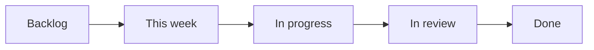

# 6. Issues, etichete, milestones și board

> Timp: 15 minute. La final știi cum iei o sarcină, cum o urmărești și cum se închide singură.

## 6.1 Ce e un issue

Un **issue** e o fișă pentru o bucată de muncă: o funcție de făcut, un bug, o observație din playtest. Are număr (`#12`), titlu, descriere, o persoană responsabilă și o discuție.

Regula noastră: **fiecare PR rezolvă un issue.** Dacă nu există issue, îl creezi întâi. Așa, pe board se vede tot ce facem, iar profesorul vede legătura issue → PR → commit-uri.

## 6.2 Cum deschizi un issue

Tab-ul **Issues** → **New issue**. Alegi unul din cele trei șabloane. Ca membru al echipei vei vedea și **Blank issue** (marcat „Maintainers only”): nu-l folosi, pentru că lipsesc câmpurile de mai jos.

| Șablon | Eticheta pusă automat | Când îl folosești |
|---|---|---|
| **Sarcină** | `type:task` | O funcție, o reparație planificată, teste, documentație. |
| **Bug** | `type:bug` | Ceva nu merge cum ar trebui. |
| **Observație din playtest** | `playtest` | O problemă care vine din datele unui playtest (doar cifre agregate). |

Eticheta se pune singură doar dacă există deja în repo. `bug` există din start; `sarcină` și `playtest` le creează Kevin o singură dată, din **Issues → Labels**.

Completezi câmpurile din formular. Cele mai importante:

- **Titlul**: scurt și clar, de exemplu „BattleModel: daune și limitele HP”.
- **Gata când**: ceva ce se poate verifica („Testele GUT pentru daune trec în CI”, „HP nu scade sub 0”). Fără asta nu știm când e gata.
- **Zona**: `world`, `battle`, `ui`, `quiz-data`, `ci` sau `docs`.
- **Prioritate (MoSCoW)**: Must, Should sau Could.

O sarcină bună se termină în **1-3 zile**. Dacă e mai mare, o împarți în mai multe issue-uri.

În dreapta paginii issue-ului:

- **Assignees**: cine lucrează la el (de obicei tu, apăsând **assign yourself**).
- **Projects**: board-ul echipei (vezi 6.4).
- **Milestone**: versiunea în care trebuie să fie gata (vezi 6.3).

## 6.3 Milestones: versiunile

Un **milestone** grupează issue-urile pentru o versiune și arată cât mai e de lucru (bara de progres).

| Milestone | Data | Ce înseamnă |
|---|---|---|
| **v0.1** | 9 nov | Primul public: capitolul 1 jucabil până la Tengu. |
| **v0.2** | 7 dec | Capitolul 2 (Kyoto) și corecturile din playtest. |
| **v1.0-rc** | 21 dec | Versiunea candidată, live în vacanță ca să adune date. |
| **v1.0** | 11 ian 2027 | Versiunea finală (tag), doar bug fix-uri după 21 dec. |

Le vezi în **Issues → Milestones**.

## 6.4 Board-ul (GitHub Projects)

Board-ul e în tab-ul **Projects** al repo-ului. Fiecare issue e un card. Coloanele:



| Coloană | Ce e acolo | Cine mută cardul |
|---|---|---|
| **Backlog** | Tot ce trebuie făcut cândva. | Oricine adaugă. |
| **This week** | Ce am ales luni, la planificare, pentru săptămâna asta. | Echipa, luni la lab. |
| **In progress** | Ce lucrezi acum. Maximum 1-2 carduri de persoană. | Tu, când începi. |
| **In review** | PR deschis, așteaptă review sau CI. | Tu, când deschizi PR-ul. |
| **Done** | Îmbinat în `main`. | Automat, la merge. |

Câmpurile fiecărui card:

| Câmp | Valori |
|---|---|
| **Priority** | Must / Should / Could |
| **Area** | world / battle / ui / quiz-data / ci / docs |
| **Iteration** | săptămâna de laborator (de luni până duminică) |

Iterațiile: câte una pentru fiecare săptămână de laborator. Fără iterație în săptămâna din **30 nov** (nu e laborator) și în vacanța **24 dec până la 10 ian**.

Kevin activează pe board regulile automate (**Workflows**): când un issue se închide sau un PR se îmbină, cardul trece singur în **Done**.

## 6.5 Legătura dintre PR și issue: `Closes #N`

În descrierea PR-ului (în șablon, la „Ce face”) scrii:

```text
Closes #12
```

Ce se întâmplă:

1. PR-ul apare în pagina issue-ului #12, în coloana din dreapta, la **Development**.
2. Când PR-ul e îmbinat în `main`, **issue-ul #12 se închide automat**.
3. Cardul trece în **Done**.

Detalii:

- Merg și `Fixes #12` sau `Resolves #12`. Folosim `Closes` ca să fie la fel peste tot.
- Pentru două issue-uri: `Closes #12, closes #13` (cuvântul înaintea fiecărui număr).
- Funcționează doar când PR-ul e spre `main`. La noi toate PR-urile sunt spre `main`.
- Vrei doar să pomenești un issue fără să-l închizi? Scrii `#12` simplu, sau `Part of #12`.

În commit-uri poți pomeni și tu issue-ul (`fix(battle): clamp HP at zero (#12)`), dar închiderea o face PR-ul.

## 6.6 Săptămâna pe board

| Când | Ce faci pe board |
|---|---|
| **Luni, planificare (20 min)** | Fiecare alege 2-4 carduri din Backlog → **This week**, cu Iteration setată. Ne uităm la Must-uri întâi. |
| **Când începi un card** | Te asignezi, îl muți în **In progress**, faci branch-ul. |
| **Când deschizi PR-ul** | Muți cardul în **In review**. |
| **Joi** | Check-in de 3 rânduri în chat-ul echipei: gata / urmează / blocat. Dacă ești blocat, scrii și în issue. |
| **Duminică, 22:00** | Ce e în **In review** și are CI verde se îmbină. Restul rămâne pentru săptămâna următoare. |

Exemplu de check-in:

```text
Gata: BattleModel calculează daunele (#14)
Urmează: teste pentru WIN, LOSE și FLEE
Blocat: aștept encounters.json (#9)
```

## 6.7 Comentarii utile în issue-uri

- `@utilizator`: chemi un coleg (primește notificare).
- `#14`: link către issue-ul sau PR-ul 14.
- Un commit pomenit prin id (`a1b2c3d`) devine link.
- O listă de bifat (`- [ ] pas`) împarte o sarcină în pași mici.

Nu pune niciodată date personale în issue-uri: nume de testeri, e-mailuri, poze cu oameni. Repo-ul e public.

---

Înapoi: [5. Sincronizare și conflicte](05-sincronizare-si-conflicte.md) · Următorul: [7. CI](07-ci.md)
