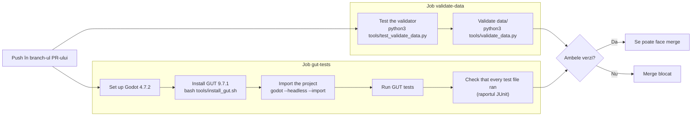

# 7. CI: verificările automate (GitHub Actions)

> Timp: 15 minute. La final știi ce înseamnă X-ul roșu și cum îl repari fără să aștepți după GitHub.

## 7.1 Ce e CI

**CI** (Continuous Integration) înseamnă că, la fiecare schimbare, un calculator de pe GitHub ia codul de la zero și rulează aceleași verificări. La noi le face **GitHub Actions**, după fișierul [`.github/workflows/ci.yml`](../../.github/workflows/ci.yml) (proprietar: Ioana).

CI rulează:

- la fiecare **pull request** (și la fiecare push nou în branch-ul PR-ului),
- la fiecare push în `main` (adică după fiecare merge).

`main` e protejat: **un PR nu se poate îmbina dacă CI e roșu.** Asta e regula „CI obligatoriu” din planul echipei și din CONTRIBUTING.md (secțiunea 4).

## 7.2 Cele două joburi



| Job | Ce verifică | Pică de obicei când |
|---|---|---|
| **validate-data** | Că fișierele JSON din `data/` respectă formatul: id-uri unice, câmpuri obligatorii, pool-uri care trimit la id-uri existente, ș și ț cu virgulă. Întâi își testează chiar validatorul. | Ai greșit o virgulă în JSON, un id e dublat, ai scris ș sau ț cu sedilă în loc de virgulă. |
| **gut-tests** | Pornește Godot 4.7.2 fără fereastră (`--headless`), instalează GUT, importă proiectul și rulează toate testele din `tests/unit/`. | Un test pică, un script nu se compilează, lipsește un fișier pe care ai uitat să-l comiți, o cale are majuscule greșite (CI rulează pe Linux, unde `Player.gd` și `player.gd` sunt fișiere diferite). |

Cele două joburi rulează în paralel, fiecare pe o mașină Ubuntu curată. Durează de obicei câteva minute.

## 7.3 Unde vezi rezultatul

Pe pagina PR-ului, jos, în căsuța cu verificări:

| Semn | Înseamnă |
|---|---|
| Cerc galben | Rulează încă. |
| Bifă verde | A trecut. |
| X roșu | A picat. Trebuie reparat. |
| Cerc gri | Așteaptă sau a fost anulat (de exemplu ai făcut push din nou și rularea veche s-a oprit). |

Același semn apare în lista de commit-uri și pe tab-ul **Actions** al repo-ului.

## 7.4 Cum citești un X roșu

1. Pe pagina PR-ului, la jobul roșu, apeși **Details**.
2. Se deschide log-ul. În stânga vezi joburile, în mijloc pașii jobului ales. Pasul care a picat are un X roșu și e deja deschis.
3. Citește **ultimele 20-30 de rânduri** ale pasului roșu. Acolo e cauza. Primele rânduri sunt de obicei doar instalare.
4. Caută cuvinte ca `FAILED`, `ERROR`, `Error`, `SCRIPT ERROR`, `Parse Error`, `Traceback`.

### Exemple

**validate-data**, JSON greșit:

```text
EROARE  data/hiragana.json: JSON invalid la linia 19, coloana 7: Illegal trailing comma before end of object.
EROARE  data/pools.json pools.c1_row_a: „h_a” nu există în hiragana.json sau katakana.json.
...
Datele au probleme: 93 erori, 0 avertismente.
```

Deschizi fișierul la linia 19. Aici e o virgulă în plus înainte de `}`. **Repari mereu prima eroare întâi**: celelalte 92 apar doar pentru că `hiragana.json` nu s-a putut citi deloc, iar `pools.json` trimite la id-uri din el.

**gut-tests**, un test care pică:

```text
res://tests/unit/test_battle_model.gd
* test_damage_is_clamped
    [Failed]:  [12] expected to equal [10]
      at line 27
```

Testul de la rândul 27 din `test_battle_model.gd` aștepta 10 și a primit 12. Fie codul are un bug, fie testul e greșit. Decizi care dintre ele și repari.

**gut-tests**, cod care nu se compilează:

```text
SCRIPT ERROR: Parse Error: Could not find base class "KinematicBody2D".
   at: GDScript::reload (res://world/player/player.gd:1)
```

E cod de Godot 3. În Godot 4 clasa se numește `CharacterBody2D`.

(Mesajele exacte pot arăta puțin diferit. Ideea e aceeași: fișierul, rândul, problema.)

## 7.5 Repari și trimiți din nou

```bash
# pe branch-ul tău
git add <fisierele-reparate>
git commit -m "fix(battle): correct damage in BattleModel test"
git push
```

CI pornește singur din nou. Nu trebuie să deschizi alt PR.

Butonul **Re-run jobs** (în pagina log-ului) e doar pentru probleme care nu țin de cod, de exemplu GitHub nu a reușit să descarce Godot. Dacă testul tău pică, a doua rulare va pica la fel.

## 7.6 Rulezi aceleași verificări la tine, înainte de push

Mai rapid decât să aștepți după GitHub.

### Datele

```bash
python3 tools/test_validate_data.py
python3 tools/validate_data.py
```

Pe Windows, dacă `python3` nu există, încearcă `py tools/validate_data.py` sau `python tools/validate_data.py`.

### Testele GUT, din editor (cel mai simplu)

1. O singură dată după clonare: `bash tools/install_gut.sh` (Windows: `powershell -ExecutionPolicy Bypass -File tools/install_gut.ps1`).
2. În Godot, panoul **GUT** de jos → **Run All**.
3. Toate trebuie să fie verzi.

### Testele GUT, din terminal (exact ca în CI)

```bash
godot --headless --import
godot --headless -s addons/gut/gut_cmdln.gd -gconfig=.gutconfig.json -gexit
```

Prima comandă e necesară o dată pe o clonă nouă (construiește folderul `.godot/`). A doua rulează testele și se termină cu codul 0 dacă totul e verde.

`godot` trebuie să fie programul Godot 4.7.2:

| Sistem | Cum îl chemi |
|---|---|
| macOS | `/Applications/Godot.app/Contents/MacOS/Godot` în loc de `godot`, sau, ca să scrii doar `godot` până închizi terminalul: `alias godot="/Applications/Godot.app/Contents/MacOS/Godot"` |
| Windows (PowerShell) | calea către fișierul `Godot_v4.7.2-stable_win64_console.exe`, de exemplu `& "C:\Godot\Godot_v4.7.2-stable_win64_console.exe" --headless --import` |
| Linux | calea către fișierul descărcat, de exemplu `~/Godot/Godot_v4.7.2-stable_linux.x86_64` |

## 7.7 Ce **nu** face CI la noi

- Nu testează pe telefon. Asta faci tu, conform DoD (desktop + 1 telefon).
- Nu verifică dacă jocul „arată bine”. Asta e treaba review-ului.
- Nu repară nimic singur. Doar spune ce e greșit.

Fișierul `ci.yml` e al Ioanei. Dacă vrei o verificare nouă, deschide un issue pentru ea.

---

Înapoi: [6. Issues și board](06-issues-si-board.md) · Următorul: [8. Git în Godot](08-git-in-godot.md)
