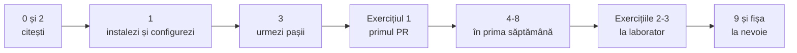

# Git și GitHub pentru echipa noastră

Un manual scurt, în română, pentru cine n-a mai lucrat cu Git într-o echipă. Folosește exact regulile, numele și fișierele din proiectul nostru, nu exemple generale.

- **Pentru cine**: toți patru, mai ales cine folosește Git pentru prima dată într-o echipă.
- **Ce știi la final**: să lucrezi pe branch-ul tău, să deschizi un pull request, să faci review, să rezolvi un conflict și să repari greșelile obișnuite fără panică.
- **Regulile oficiale** sunt în [CONTRIBUTING.md](../../CONTRIBUTING.md). Ghidul le explică pas cu pas. Dacă ceva diferă, are dreptate CONTRIBUTING.md și ne spui, ca să corectăm ghidul.

## Cuprins

| # | Capitol | Despre ce | Timp | Până când |
|---|---|---|---|---|
| 0 | [Introducere](00-introducere.md) | De ce Git, ce e GitHub, o zi de lucru, ritmul săptămânii | 15 min | 12 oct |
| 1 | [Instalare și configurare](01-instalare.md) | Git, cont GitHub, adresa noreply, autentificare, clonare | 30-45 min | 12 oct |
| 2 | [Conceptele de bază](02-concepte.md) | Repo, commit, branch, remote, pull request, merge | 20 min | 12 oct |
| 3 | [Primul flux complet](03-primul-flux.md) | De la issue la merge, cu comenzile exacte | 30 min | 12 oct |
| 4 | [Review](04-review.md) | Opțional: cum rulezi și comentezi PR-ul unui coleg | 20 min | 19 oct |
| 5 | [Sincronizare și conflicte](05-sincronizare-si-conflicte.md) | `git merge main`, conflicte pas cu pas, regula `.tscn` | 30 min | 19 oct |
| 6 | [Issues și board](06-issues-si-board.md) | Șabloane, milestones, GitHub Projects, `Closes #N` | 15 min | 19 oct |
| 7 | [CI](07-ci.md) | GitHub Actions: `validate-data` și `gut-tests`, X-ul roșu | 15 min | 19 oct |
| 8 | [Git în Godot](08-git-in-godot.md) | Ce comiți și ce nu, `.uid`, `.godot/`, majuscule | 20 min | 19 oct |
| 9 | [Greșeli frecvente](09-greseli-frecvente.md) | 12 situații, cu comenzile de reparat | la nevoie | |
| 10 | [Exerciții](10-exercitii.md) | PR în TEAM.md, conflict în perechi, review | 1 h 30 min | 12 oct (ex. 1), lab (ex. 2-3) |
| | [Fișa de comenzi](fisa-de-comenzi.md) | Toate comenzile pe o pagină | | |

**Total**: aproximativ 3 ore de citit și 1 oră și jumătate de exerciții. Capitolele 0-3 și exercițiul 1 sunt obligatorii înainte de laboratorul din **12 octombrie**. Restul, până pe **19 octombrie**.

## Ordinea recomandată

## Cum citești comenzile

- Comenzile sunt în blocuri gri. Le scrii în terminal fără comentariile de după `#`.
- `<...>` înseamnă „pui aici valoarea ta”, fără `<` și `>`. De exemplu `<prenume>` devine `mariana`.
- Exemplele folosesc nume reale din proiect (`feat/battle-hp-bar`, `world/maps/tokyo_town.tscn`). Când lucrezi, pui numele sarcinii tale.
- Comenzile merg cu orice Git de la versiunea 2.23 în sus (la instalare primești de obicei 2.4x sau mai nou). Folosim `git switch` și `git restore`, comenzile noi și mai clare. Pe internet vei vedea des `git checkout`: face aproape aceleași lucruri, dar le amestecă.

## Resurse gratuite recomandate

| Resursă | Ce înveți | Timp | Limba | Până când |
|---|---|---|---|---|
| [GitHub Skills: Introduction to GitHub](https://github.com/skills/introduction-to-github) | Primul branch, commit și PR, într-un repo de exercițiu al tău | sub 1 h | engleză | 12 oct |
| [Learn Git Branching](https://learngitbranching.js.org/?locale=ro) | Branch, merge și istoricul, desenat și interactiv. Fă măcar secțiunea „Introducere” (nivelul despre rebase doar îl citești: noi nu folosim rebase) | 2 h | **română** | 19 oct |
| [Godot docs: Version control systems](https://docs.godotengine.org/en/4.7/tutorials/best_practices/version_control_systems.html) | Ce ignorăm în Godot și de ce (LF, `.godot/`) | 30 min | engleză | 19 oct |
| [GitHub Skills: Review pull requests](https://github.com/skills/review-pull-requests) | Comentarii, sugestii, aprobare | sub 30 min | engleză | opțional |
| [GitHub Skills: Resolve merge conflicts](https://github.com/skills/resolve-merge-conflicts) | Conflicte, în browser | 30 min | engleză | opțional |
| [Conventional Commits](https://www.conventionalcommits.org/ro/v1.0.0/) | Formatul mesajelor de commit | 10 min | **română** | opțional |
| [Pro Git](https://git-scm.com/book/en/v2) | Cartea oficială despre Git, capitolele 1-3 | după chef | engleză | opțional |

Despre **Pro Git în română**: am verificat pe [git-scm.com/book](https://git-scm.com/book/en/v2) (5 oct 2026) și nu există o traducere în română, nici parțială. Varianta în engleză e gratuită. Pentru început, ghidul acesta și Learn Git Branching (care are română) ajung.

Atenție la tutorialele găsite singur: multe arată `git checkout` și `git push --force`. La noi folosim `git switch` / `git restore` și nu facem niciodată force push.

## Ajutor

1. Caută problema în [capitolul 9](09-greseli-frecvente.md).
2. Dacă nu o găsești, scrie în chat-ul echipei ce ai rulat și ce a răspuns `git status`.
3. La laborator lucrăm în perechi. Nimeni nu trebuie să rămână blocat singur.

## Documente legate

| Document | Pentru ce |
|---|---|
| [CONTRIBUTING.md](../../CONTRIBUTING.md) | Regulile oficiale: branch-uri, commit-uri, PR, review |
| [docs/DEFINITION_OF_DONE.md](../DEFINITION_OF_DONE.md) | Când e o sarcină „gata” |
| [docs/TEAM.md](../TEAM.md) | Echipa și exercițiul 1 |
| [docs/contracts.md](../contracts.md) | Contractele dintre module, folderele și proprietarii lor |
| [.github/pull_request_template.md](../../.github/pull_request_template.md) | Șablonul de PR |
| [.github/workflows/ci.yml](../../.github/workflows/ci.yml) | Verificările automate |
